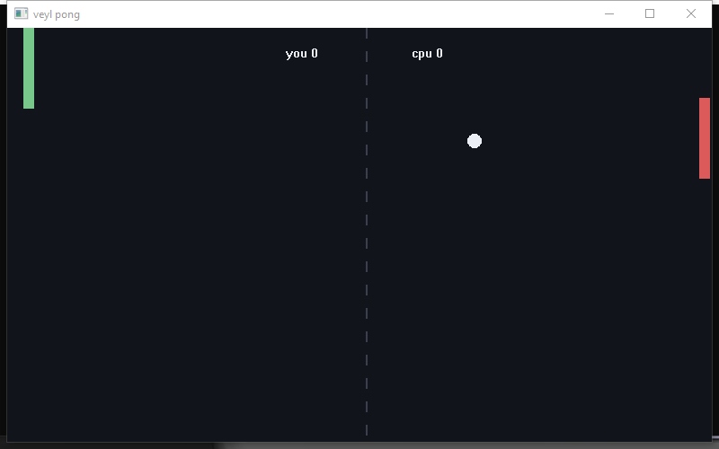
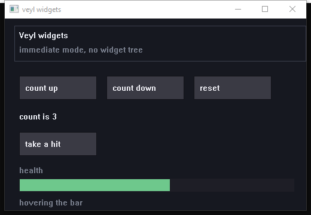

# Veyl

Veyl is a programming language for people who want a real executable at
the end and do not want to fight the language to get one. You write
something that reads like Python. You get a single `.exe` with nothing
to install alongside it.

```veyl
fn isPrime(n: int) -> bool {
    if n < 2 { return false }
    for d in 2..=int(sqrt(float(n))) {
        if n % d == 0 { return false }
    }
    return true
}

for n in 2..50 {
    if isPrime(n) { write("{n} ") }
}
print("")
```

```
$ veyl run primes.vl
2 3 5 7 11 13 17 19 23 29 31 37 41 43 47
```

No semicolons. No header files. No boilerplate `main`. No manual memory.
Math, strings, files, HTTP, JSON, regular expressions and time are all
builtins, so most programs need no imports at all.

**Version 0.18.0.** Veyl compiles straight to x86-64 and writes the
executable itself. It encodes the instructions, resolves the symbols
and lays out the PE, so there is no assembler, no linker, no C
toolchain and no Go in the pipeline, and none of them in what comes
out.

```
primes.vl  ->  [veyl]  ->  primes.exe
```

That is the whole build. The same `collatz.vl` that produced a 2.4 MB
executable through the old Go backend produces one of **2,560 bytes**
here, and the installer is 5 MB instead of 90, because there is no
toolchain to bundle.

The old backend is not gone. It is on the
[`veylgo`](../../tree/veylgo) branch, discontinued but still building,
and it is the reference this compiler is checked against: every program
in its test suite compiles here and prints the same bytes, error
messages included. Where the two disagree, this one is wrong.

---

## Contents

- [Install](#install)
- [Commands](#commands)
- [Packages](#packages)
- [A tour of the language](#a-tour-of-the-language)
- [How it compiles](#how-it-compiles)
- [Building from source](#building-from-source)
- [Project layout](#project-layout)
- [Roadmap](#roadmap)
- [Known limitations](#known-limitations)

New here? [Learn Veyl in 20 minutes](docs/TUTORIAL.md).

Reference: [SYNTAX.md](docs/SYNTAX.md)
Internals: [ARCHITECTURE.md](docs/ARCHITECTURE.md)

---

## Install

On Windows, run the installer from the
[releases page](https://github.com/owlspan/veyl/releases). It is about
7.5 MB, adds the compiler to PATH if you let it, sets up editor
highlighting, and puts Run and Compile on the right-click menu for
`.vl` files.

There is nothing else to install. No Go, no assembler, no linker, no C
runtime. That is the point of this version, and it is why there is no
`doctor` command any more: there is no toolchain to go looking for.

To build the installer yourself, double-click
`asm-src\scripts\make-installer.bat`.

---

## Commands

| Command | Effect |
| --- | --- |
| `veyl run f.vl` | compile and run |
| `veyl build f.vl` | write an executable next to the source |
| `veyl asm f.vl` | print the generated assembly |
| `veyl ir f.vl` | print the intermediate representation |
| `veyl version` | print the version |
| `veyl f.vl` | same as `run` |

Anything after the `.vl` file goes to your program, not to Veyl, so
`veyl run app.vl --verbose` reaches `os.args()`.

`asm` and `ir` are the debugging tools. When a program does something
strange, read what it actually compiled to. `ir` is the readable one:
three-address code over virtual registers, before anything knows an
x86 register exists.

### Explorer

Right-clicking a `.vl` file gives **Run with Veyl** and **Compile to
.exe**, with a **Veyl** submenu underneath holding the generated
assembly, the IR, and a prompt in that folder. Right-clicking any
folder gives **Open Veyl prompt here**. Double-clicking a `.vl` file
runs it.

All of them go through `cmd /K`, so the console stays up long enough to
read what it said, whether that was a path or a list of errors.

### Packages

Libraries that are not built in are installed per project:

```
veyl get totp                          the official registry
veyl get github.com/you/thing          anyone's repository
veyl get https://example.com/x.vl      a single file
veyl list
veyl remove totp
```

Or all of them:

```
veyl get officials                     every official package
veyl get officials --nodlls            the same, minus the ones
                                       carrying a native library
veyl get github.com/you/registry --all any registry
```

`--nodlls` is about size. Everything official is a few kilobytes except
`sqlite`, which is three megabytes because it carries the real library.
A registry says what it holds in a `veyl.index` file, so `--all` works
on anyone's, not only this one.

They land in `./veyl_modules` next to your program rather than
machine-wide, so a project carries its own dependencies and deleting
the directory uninstalls everything. Reach one with a bare import:

```veyl
import "totp"
print(must(totpNow(secret)))
```

The registry is [owlspan/veyl-packages](https://github.com/owlspan/veyl-packages),
and its README covers writing your own - you do not need to be in the
registry to publish one.

A package may ship a native `.dll`, which `veyl build` copies next to
the executable. That is how something like SQLite can be available
without every install carrying it.

**One thing to know:** an import lands in a flat namespace. There is no
`totp.` qualifier yet, so packages prefix their exported names by
convention - `totpNow`, not `now`.

### Editors

The installer sets up syntax highlighting for VS Code, Notepad++,
Sublime Text and Vim/Neovim; the files are in
[`editors/`](editors/). VS Code goes straight into the extensions
folder, so there is no marketplace step.

---

## A tour of the language

### Variables

```veyl
let count = 0            // mutable, type inferred
const limit = 10         // cannot be reassigned
let name: str = "Veyl"   // explicit type

count += 1
```

Reading an undeclared variable is an error, not an implicit declaration.

### Types

`int`, `float`, `str`, `bool`, `bytes` for raw binary, `[]T` lists,
`{K: V}` maps, `?T` for a value that might be missing, `T!` for one that
might have failed. Nothing converts implicitly. Use `str()`, `int()`,
`float()`.

```veyl
let nums = [3, 1, 2]
let ages = {"ada": 36}
let note: ?str = nil
```

### Structs

```veyl
struct Vec {
    x: float
    y: float
}

impl Vec {
    fn length(self) -> float {
        return sqrt(self.x * self.x + self.y * self.y)
    }
}

print(Vec{x: 3.0, y: 4.0}.length())     // 5
```

### Failure

Anything that can fail returns `T!`, or `void!` when there is no value
to hand back. `?` either unwraps it or hands the failure up.

```veyl
fn wordCount(path: str) -> int! {
    let text = os.file.read(path)?
    return len(split(trim(text), " "))
}
```

That is the whole error-handling story. No exceptions, no panics in
normal code, and no way to ignore a failure by accident.

### Functions

```veyl
fn add(a: int, b: int) -> int {
    return a + b
}
```

Parameter types are required. Declaration order does not matter, so a
function can call one defined further down. A function with a return
type must return on every path and the compiler checks it.

Functions are values:

```veyl
let nums = [5, 3, 8, 1]
print(map(nums, fn(n: int) -> int { return n * n }))
print(filter(nums, fn(n: int) -> bool { return n > 4 }))
print(reduce(nums, 0, fn(a: int, b: int) -> int { return a + b }))
```

Closures capture by reference, so a closure sees later writes to what it
captured, and its own writes are visible outside.

### Strings

Any expression goes inside `{}`, including another string literal:

```veyl
let name = "world"
print("hello, {name}")
print("2 + 2 = {2 + 2}")
print("shouting: {upper("hi")}")
print("{{literal braces}}")
```

### Control flow

```veyl
if score >= 90 {
    print("A")
} else if score >= 80 {
    print("B")
}

while running { tick() }

for i in 0..5 { }            // 0 1 2 3 4
for i in 1..=5 { }           // 1 2 3 4 5
for i in 0..=100 step 25 { } // 0 25 50 75 100
for i in 10..0 step -2 { }   // 10 8 6 4 2
```

No parentheses around conditions. Braces always required.

### Multiple files

```veyl
import "geometry.vl"
```

`pub` decides what a file exports. A top-level `const` is a global; a
top-level `let` belongs to the program body.

### The library

No imports, ever. The dots only group names.

**Output** `print` `write`
**Convert** `str` `int` `float` `toInt` `isInt` `divf`
**Math** `sqrt` `cbrt` `pow` `exp` `hypot` `log` `log2` `log10` `abs`
`mod` `floor` `ceil` `round` `trunc` `clamp` `sign` `isNan` `min` `max`
`sin` `cos` `tan` `asin` `acos` `atan` `atan2`
**Strings** `len` `upper` `lower` `trim` `contains` `startsWith`
`endsWith` `indexOf` `replace` `repeat` `charAt` `substr` `split`
`chars` `lines`
**Lists** `push` `pop` `insert` `removeAt` `clear` `first` `last`
`slice` `reverse` `sort` `sum` `join` `map` `filter` `reduce` `sortBy`
`any` `all` `each`
**Maps** `has` `find` `remove` `keys` `values`
**Results** `must` `valueOr` `isOk` `failed` `errorOf` `fail`

And under a namespace: `os` for files and processes, `http`, `net`,
`json`, `time`, `re` for regular expressions, `hash`, `csv`, `bytes`,
`rand`, `stats`, `term`, `bits`, `url`, `args`, `mem`, `task`, and
`win` for windows and drawing.

```veyl
let rows = must(csv.read("sales.csv"))
let names = task.map(rows, fn(r: []str) -> str { return upper(r[0]) })
os.file.write("names.txt", join(names, "\n"))
print("saved at {time.stamp()}")
```

### Servers

`http` and `net` are here, so a web server is a few lines:

```veyl
must(http.serve(8080, fn(req: Request) -> Response {
    if req.path == "/" {
        return http.ok("<h1>hello from veyl</h1>")
    }
    if req.path == "/api" {
        return http.json(json.encode({"ok": true}))
    }
    return http.notFound()
}))
```

`Request` gives you `method`, `path`, `query`, `body` and `headers`,
with `http.header(req, name)` for a case-insensitive lookup. Responses
come from `http.ok`, `http.text`, `http.json`, `http.status` and
`http.notFound`. `http.get(url)` fetches a page.

Underneath is `net`: `listen`, `accept`, `recv`, `send`, `connect` and
`close`, over WinSock. A socket is a plain int, which is why the whole
HTTP layer above it is ordinary Veyl rather than compiler internals.
There is a worked example in
[`asm-src/examples/net/`](asm-src/examples/net/server.vl).

It is HTTP/1.1 with `Connection: close`, one request at a time. No
keep-alive, no chunked transfer, no TLS, and `http.get` refuses an
`https` URL rather than pretending. Concurrency would come from running
the accept loop through `task`.

### Windows and games

`win` opens a real window you can draw in, with a game loop rather than
the old backend's blocking call that drew nothing:

```veyl
let w = must(win.open("pong", 800, 500))
while win.poll(w) {
    if win.pressed(w, "esc") { break }
    if win.pressed(w, "up") { py = py - 7.0 }

    win.clear(w, win.rgb(18, 20, 28))
    win.rect(w, 18, int(py), 12, 90, win.rgb(120, 200, 140))
    win.circle(w, int(bx), int(by), 8, win.rgb(235, 238, 245))
    win.text(w, 20, 20, "score {score}", win.rgb(235, 238, 245))
    win.present(w)
    sleep(16)
}
```



Drawing is `clear`, `rect`, `circle`, `line` and `text`, into a back
buffer that `present` blits in one go, so nothing flickers. Input is
`pressed(w, "space")` by key name, `mouseX`, `mouseY`, `mouseDown` and
`clicked`, the last edge-triggered so a click fires once.

On top of those, written in Veyl, is an immediate-mode widget set:
`button`, `bar`, `frame` and `hover`. There is no widget tree and
nothing to keep in sync - a button draws itself and returns whether it
was clicked in the same call.



Both examples are in
[`asm-src/examples/gui/`](asm-src/examples/gui/pong.vl).

There is no custom window procedure anywhere in this. The class uses
`DefWindowProcA`, everything is read out of the message queue in
`win.poll`, and a closed window is noticed with `IsWindow`. The old
backend needed a `syscall.NewCallback` for that and had a fixed pool of
them to run out of.

Not here yet: `zip`, and a handful of small builtins the old backend
has - `input`, `pause`, `padLeft`, `padRight`, `toFloat`, `isFloat` and
`count`. They exist on [`veylgo`](../../tree/veylgo).

Anything missing is a compile error naming it, never wrong output. That
is the rule the whole subset rests on: `library.go` is the list, and a
function absent from it is a type error with a file, line and column,
not something the compiler discovers halfway through.

[SYNTAX.md](docs/SYNTAX.md) has every signature.

---

## How it compiles

Five stages. The first three are shared with the old backend, which is
what makes the comparison below meaningful: the two agree on what a
program means and differ only in how they emit it.

| Stage | In | Out |
| --- | --- | --- |
| Lex and parse | text | an AST |
| Check | AST | typed AST |
| Lower | typed AST | three-address IR over virtual registers |
| Emit | IR | x86-64 |
| Assemble, link, write | x86-64 | a `.exe` |

`ir.go` is the backend boundary and nothing in it knows an x86 register
exists, which is what would make a second target a swap rather than a
rewrite.

The last stage is the unusual one. Most compilers stop at assembly text
and hand it to `as` and `ld`. This one encodes the instructions itself,
checked byte for byte against GNU `as` across every example, resolves
symbols through a six-byte thunk per import, and writes the PE headers
directly.

There is no base relocation table, because every reference the compiler
emits is a direct call or rip-relative and nothing in the file holds an
absolute address. That removes a section and a pass. It also means no
ASLR, which is a real security property and the obvious thing to add
back.

`collatz.vl`, nested loops, 10,000 iterations. The two right-hand
columns are the same machine code; only the linking differs.

| | old Go backend | asm, linked by gcc | asm, self-linked |
| --- | ---: | ---: | ---: |
| runtime, best of 5 | 67 ms | 81 ms | 81 ms |
| executable size | 2,524,160 | 123,102 | **2,560** |

The size difference is the Go runtime, which is no longer there. The
speed difference is that every value still round-trips through a stack
slot, because there is no register allocator yet. That is the next
performance work, not a finish line.

[asm-src/README.md](asm-src/README.md) has the detail.

---

## Building from source

The compiler is written in Go, so building it needs Go 1.21 or newer.
Running it, and running what it produces, needs nothing.

```
git clone https://github.com/owlspan/veyl
cd veyl/asm-src
go build -o veyl.exe ./compiler
```

Add that folder to your PATH to run it from anywhere. While working on
the compiler itself, skip the rebuild:

```
go run ./compiler run examples/primes.vl
```

The first `run` is Go's, the second is Veyl's.

**Never run a freshly built program from new library code uncapped.**
Nothing collects on its own here, so a loop that allocates and never
terminates will fill memory rather than being collected out of trouble.
`asm-src\scripts\saferun.ps1` puts the program in a job object with a
memory limit and a timeout:

```
.\scripts\saferun.ps1 -Exe .\prog.exe -MemoryMB 512 -TimeoutSec 30
```

### Tests

```
cd src      && go test ./...
cd frontend && go test ./...
cd asm-src  && go test ./...
```

The three modules are separate, so there is no single command that
covers everything.

There are no expected-output files here. Every example is compiled by
both this compiler and the reference one on
[`veylgo`](../../tree/veylgo), and the output is compared byte for
byte. If they disagree, this one is wrong. A second test asserts that
anything outside the supported set is a *compile error* rather than
wrong output, because a compiler that quietly mis-compiles what it does
not understand is worse than one that refuses.

The differential half skips unless the reference is built. It is looked
for at `../veylgo/src/veyl.exe`, or wherever `VEYL_REFERENCE` points.

`encode_test.go` checks every instruction byte against GNU `as`, and
`pe_test.go` checks the shape of the executable that comes out. Both
skip if MinGW is not installed; everything else still runs.

`VEYL_GC_STRESS=1` collects before every statement, and the suite must
stay byte-identical under it. That is the only way a collector bug
shows up near its cause.

---

## Project layout

```
veyl/
  frontend/    lexer, parser, type checker
  asm-src/     the compiler: lowerer, emitter, assembler, linker,
               PE writer, and the library written in Veyl itself
  docs/        SYNTAX, TUTORIAL, ARCHITECTURE
  icons/       shared branding
```

Two Go modules wired together with `replace`. Run `go` commands from
inside each one; there is no single command that covers both.

Most of the library is not in Go at all. `prelude_*.go` hold Veyl
source that this compiler compiles: the math library, time, bits, url,
stats, term, rand, the regex engine, the hashes and csv. Adding a
library function is a signature in `library.go`, an entry in
`preludeOf`, and the function itself in Veyl.

The old Go backend is on [`veylgo`](../../tree/veylgo). It is not a
dependency of anything here, but the differential test compares against
it, so building it beside this checkout is worth the two commands:

```
git worktree add ../veylgo veylgo
cd ../veylgo/src && go build -o veyl.exe ./compiler
```

---

## Roadmap

| Version | Feature |
| --- | --- |
| v0.1 | expressions, variables, `if`, `while`, `print` |
| v0.2 | functions, resolver, builtins, Windows GUI |
| v0.3 | `for` loops, `break`/`continue`, math and strings |
| v0.4 | type checker, test suite |
| v0.5 | lists and maps |
| v0.6 | structs and `impl` |
| v0.7 | JSON, bitwise operators, `match` |
| v0.8 | nullable types `?T` |
| v0.9 | error type `T!` with `?` propagation |
| v0.10 | modules, `pub`, global constants |
| v0.15 | a Windows installer bundling its own Go toolchain |
| v0.16 | a package manager, `rand`, `stats`, `term`, `log` |
| v0.17 | namespaced imports, `bytes`, an interactive console |
| v0.17.02 | four editors, an Explorer menu, the Veyl rename |
| **v0.18** | **the native compiler: no Go, no assembler, no linker** |
| next | `zip`; a register allocator; keep-alive; sound; generics |

v0.18 is where the Go backend stopped being how Veyl compiles. It took
an object header, maps, the error type, structs, a foreign-call op,
nullables, deep equality, `impl` methods, imports and real globals, a
mark-and-sweep collector, closures, the library rewritten in Veyl, an
instruction encoder, a linker, a PE writer, and finally threads. The
last of those brought the test suite to 24 of 24.

---

## Known limitations

An honest list.

- **Integer division truncates.** `7 / 2` is `3`. Use `divf(7, 2)` for
  `3.5`. This is a stated rule rather than a leaked backend detail, but
  it still catches people.
- **A missing map key is silent.** `m["absent"]` gives the zero value.
  `has()` and `find()` tell the difference. Putting a check on every
  read was not worth it.
- **No generics.** `Set` and `Queue` cannot be written in Veyl itself
  yet, which is why they are not in the library.
- **No global variables.** A top-level `const` is global; a top-level
  `let` belongs to the program body.
- **No databases.** SQLite needs a Go dependency, which would break the
  zero-dependency property.
- **Nil narrowing is syntactic.** `if x != nil` narrows inside the
  block, and `&&` chains work, but an early `return` does not narrow the
  rest of the function.
- **Garbage collected, but not automatically.** There is a mark-and-sweep
  collector; `mem.collect()` is the only thing that runs it. A program
  that allocates in an unbounded loop will exhaust memory. See
  `saferun.ps1` above.
- **No `zip`.** It exists on
  [`veylgo`](../../tree/veylgo) and has not been ported. Calling it
  is a compile error naming it.
- **The server handles one request at a time**, with `Connection:
  close`. No keep-alive, no chunked transfer, and no TLS anywhere, so
  `http.get` refuses an `https` URL rather than pretending.
- **`net.recv` returns a str**, which is NUL-terminated here, so a
  response carrying a zero byte reads back short. Binary bodies want
  `bytes` and it is not wired through yet.
- **No resolver.** A name that is neither a local, a function nor a
  builtin is caught by the lowerer rather than the checker, so it is
  missed when the checker has already failed on something else.
- **No register allocator.** Every value round-trips through a stack
  slot, which is the whole of the 20% speed gap and most of the frame
  size.
- **No ASLR.** The image says RELOCS_STRIPPED, because nothing the
  compiler emits holds an absolute address. Adding a relocation table
  is the fix.
- **`NAN` and `INF` are compile errors**, deliberately: comparisons
  lower to `comisd`, which gets an unordered pair wrong, and msvcrt's
  `printf` writes `1.#INF` where Go writes `+Inf`. A wrong answer would
  be worse than a refusal.
- **Printing a float can round the last digit wrong.** It goes through
  msvcrt, which stops at seventeen significant digits.
- **Windows x86-64 only.** The PE writer and the calling convention are
  both specific to it.
- **Return checking is conservative.** A function whose only `return` is
  inside a loop is rejected, even when it is provably fine.
